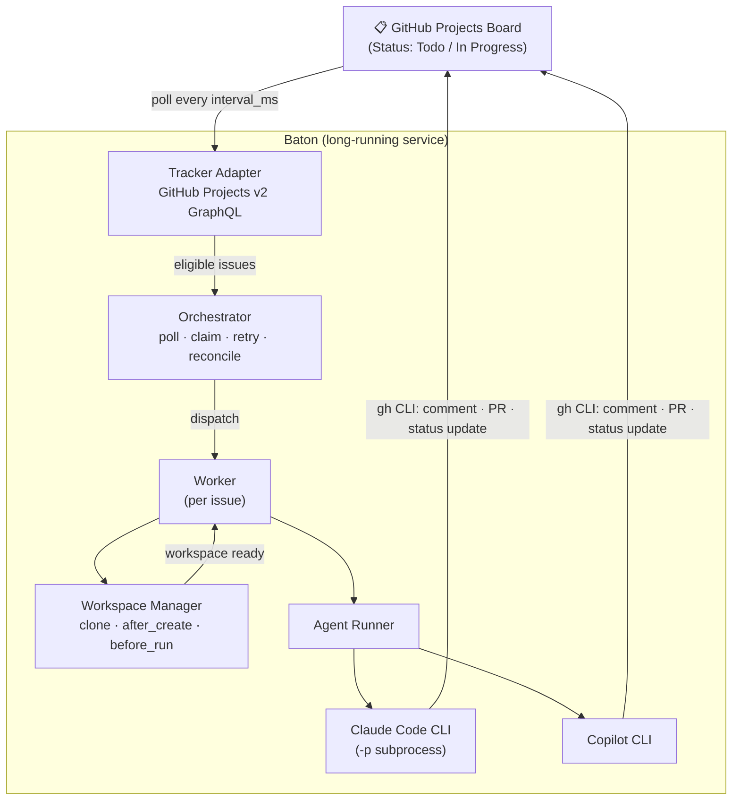
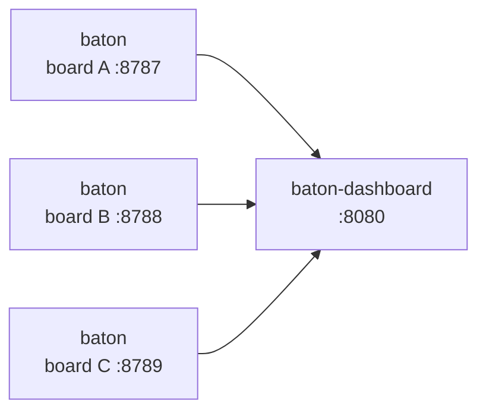

# Baton

Baton conducts coding agents against a GitHub Projects board — the thing you wave to make a
[symphony](https://github.com/openai/symphony) happen.

Baton is a long-running automation service that continuously reads work items from a
**GitHub Projects (v2)** board, creates an isolated workspace for each issue, and runs a coding
agent session — **Claude Code CLI** (via `claude -p` subprocess mode) or **GitHub Copilot CLI** —
for that issue inside the workspace. Engineers manage the work on the board; Baton manages the
agents.

Baton is a port of the [Symphony service specification](../symphony/SPEC.md) with two adapter
layers swapped:

| Layer | Symphony | Baton |
|---|---|---|
| Issue tracker | Linear (GraphQL) | GitHub Projects v2 (GraphQL) |
| Coding agent | Codex app-server | Claude Code CLI (`claude -p`) / Copilot CLI |

Everything else — the polling orchestrator, claim/retry/reconciliation state machine, per-issue
workspaces, the repository-owned `WORKFLOW.md` contract, and the observability requirements —
follows the Symphony spec unchanged.

> [!WARNING]
> Baton runs coding agents with auto-approved permissions in trusted environments. Read the
> [Security](#security) section before pointing it at a real board.

## Documents

- [`docs/SPEC.md`](docs/SPEC.md) — the Baton service specification (language-agnostic, normative,
  same chapter structure as Symphony's `SPEC.md`)
- [`CLAUDE.md`](CLAUDE.md) — architecture overview and implementation conventions for contributors

## Installation

**Prerequisites**

- [Node.js](https://nodejs.org/) ≥ 22
- [`gh` CLI](https://cli.github.com/) — used by the agent inside each workspace
- The coding agent binary matching your `agent.kind`:
  - `claude_code` → [Claude Code CLI](https://docs.anthropic.com/en/docs/claude-code)
  - `copilot` → [GitHub Copilot CLI](https://githubnext.com/projects/copilot-cli)
- On **Windows**: [Git Bash](https://git-scm.com/downloads) — Baton runs every agent turn and
  workspace hook via `bash -lc`. The agent CLI must be reachable from Git Bash's login `PATH`;
  if it is not, set `agent.<kind>.command` to a standalone absolute path. Native Windows paths
  like `C:\Tools\claude.exe` are normalized automatically; quote them if the path contains spaces.
  Hooks receive `BATON_WORKSPACE` in Git Bash path form and, on Windows, also
  `BATON_WORKSPACE_NATIVE` for native-tool interop.

**Build from source**

```sh
git clone https://github.com/keinstn/baton.git
cd baton/copilot
npm install
npm run build
```

Run Baton with `npm exec` after building:

```sh
npm exec baton -- WORKFLOW.md
```

## Board Setup

Before running Baton, create and configure a GitHub Projects v2 board.

**1. Create a project board**

Navigate to your organization or user profile → **Projects** → **New project**. Choose the
**Board** template so issues are arranged in columns.

**2. Configure Status columns**

A new board starts with `Todo`, `In Progress`, and `Done`. If your prompt instructs the agent
to move issues to a custom state when done (e.g. `In Review`), add that column by clicking
**+** at the right edge of the board and selecting **New option**.

The column names must exactly match the values you reference in `WORKFLOW.md`. Configure which
states Baton should pick up work from:

```yaml
tracker:
  active_states: [Todo, In Progress]   # Baton picks up issues in these states
  # terminal_states: [Done]            # (optional) default: [Done]
```

The state the agent moves issues to when done is **not** a config key — specify it in your
`WORKFLOW.md` prompt body:

> When done, move the issue's Status to "In Review" on the project board.

**3. Create a label**

Go to the target repository → **Issues** → **Labels** → **New label**. Create a label named
`ai-ready` (or whatever you list under `required_labels` in `WORKFLOW.md`). Baton only
dispatches issues that carry this label.

**4. Generate a Personal Access Token**

Go to **Settings** → **Developer settings** → **Personal access tokens** → **Fine-grained tokens**
and create a token with the scopes your setup needs:

- **Projects** — Read for the orchestrator itself; add write only if the same auth context will
  also perform project updates from workspace hooks or agent `gh` commands
- Repository access for the repos your issues live in if workspace hooks or agent `gh` commands
  will use that same token

Export it before running Baton:

```sh
export GITHUB_TOKEN=ghp_...
```

The `project_number` for `WORKFLOW.md` is the trailing integer in the project URL
(e.g. `https://github.com/orgs/my-org/projects/5` → `project_number: 5`).

## Usage

**1. Create a `WORKFLOW.md`**

The `WORKFLOW.md` file is the single configuration + prompt contract for your project. Copy one of the examples as a starting point:

- [`examples/WORKFLOW.md`](examples/WORKFLOW.md) — Claude Code agent
- [`examples/WORKFLOW.copilot.md`](examples/WORKFLOW.copilot.md) — GitHub Copilot agent

Edit the YAML front matter to point at your GitHub Project:

```yaml
tracker:
  kind: github_projects
  owner: my-org          # GitHub org or user
  project_number: 5      # Project board number
  token: $GITHUB_TOKEN   # Fine-grained PAT or GitHub App token
  active_states: [Todo, In Progress]
  required_labels: [ai-ready]
agent:
  kind: claude_code      # or: copilot
```

**2. Set environment variables**

```sh
export GITHUB_TOKEN=ghp_...   # PAT/App token used by the tracker and, unless you separate auth, inherited by hooks/agent subprocesses
export LOG_LEVEL=info         # Log verbosity: debug | info | warn | error (default: info)
```

**3. Run Baton**

```sh
npm exec baton -- WORKFLOW.md
```

`WORKFLOW.md` defaults to `./WORKFLOW.md` when omitted.

| Flag | Description |
|---|---|
| `--port N` / `-p N` | Enable the HTTP dashboard on port N (overrides `server.port` in front matter) |

Baton polls the board on every `polling.interval_ms` tick, dispatches eligible issues to agent workers, and logs structured JSON to stderr. Send `SIGINT` or `SIGTERM` to shut down gracefully.

Set `LOG_LEVEL=debug` to enable verbose diagnostic output (subprocess PIDs, agent events, GitHub API timing, tick cycle details).

## How it works (one paragraph)

Every `polling.interval_ms`, Baton queries the configured Project board for issues whose Status is
in `active_states` (e.g. `Todo`, `In Progress`) and carries the `required_labels`. Eligible issues
are claimed and dispatched to a worker, which prepares a per-issue workspace (clone via hooks),
renders the issue into the `WORKFLOW.md` prompt template, and drives a coding-agent session
(`claude -p` or `copilot -p`) in that workspace. The agent does the work and performs all tracker
writes itself with the `gh` CLI — commenting progress, opening a PR, and moving the Status out of
`active_states` (e.g. to `In Review` as instructed in the prompt).
Baton stops sessions whose issues leave the active states and cleans up workspaces for terminal
issues.

## Architecture



## Security

Baton runs a coding agent with auto-approved permissions, so treat its configuration as a
security boundary. The full model is in [`docs/SPEC.md` §15](docs/SPEC.md); the operational
essentials:

- **Issue content is untrusted input.** On public repositories, issue titles, bodies, and
  comments are externally controlled — treat them as potential prompt injection. Gate dispatch
  with `required_labels` (a label only maintainers can apply) so only triaged issues reach the
  agent.
- **Keep the tool allowlist minimal.** Grant only what the workflow needs (`Bash(gh:*)`,
  `Bash(git:*)`, the project's build/test commands, `Edit`, `Write`). `bypassPermissions`
  (Claude Code) and `allow_all_tools` (Copilot) MUST be an explicit, deliberate operator choice.
- **Scope the token narrowly.** Use a fine-grained PAT (or GitHub App) limited to the target
  repositories and the minimum scopes. The orchestrator only needs Projects read; the agent's
  `gh` writes can use a separately scoped token.
- **Require human review of agent output.** Enable branch protection and required PR review on
  target repositories so agent-authored changes cannot merge unreviewed. Consider running the
  workspace root under a dedicated OS user or container sandbox.

## Aggregated Dashboard (multiple boards)

`baton-dashboard` is a separate optional process that polls the HTTP APIs of multiple `baton`
instances and presents them in a single view — useful when one operations team manages several
GitHub Projects boards at once.

Use [`examples/baton-dashboard.yaml`](examples/baton-dashboard.yaml) as a starter config for the
aggregated dashboard process.



**Quick start**

```sh
# Copy and edit the sample config
cp examples/baton-dashboard.yaml ./baton-dashboard.yaml
# Edit targets to point at your running baton instances, then:
npm exec baton-dashboard -- baton-dashboard.yaml --port 8080
```

The dashboard is read-only: it does not manage `baton` process lifecycle. Use your OS process
manager (systemd, pm2, Docker, etc.) to run each `baton` instance independently.

**Multi-instance operation notes** (see also [`docs/SPEC.md` Appendix C](docs/SPEC.md)):

- **Distinct ports** — each `baton` instance that will be aggregated must set a unique
  `server.port` in its `WORKFLOW.md` front matter (e.g. 8787, 8788, …).
- **Separate workspace roots** — if the same repository appears in more than one Project,
  give each instance a distinct `workspace.root` to prevent workspace path collisions.
- **GraphQL rate budget** — GitHub allows 5,000 GraphQL points per hour per token. When
  multiple `baton` instances share a `GITHUB_TOKEN`, their queries draw from the same budget.
  Use distinct tokens (fine-grained PATs or GitHub Apps) or stagger `polling.interval_ms`
  values to stay within limits.

## Release flow

Baton uses [Changesets](https://github.com/changesets/changesets) to manage version bumps from
`develop` to `main`.

**On `develop`**

1. Add your code or docs change as usual.
2. If the change should affect the next release, run `npm run changeset` and commit the generated
   `.changeset/*.md` file with a `major`, `minor`, or `patch` bump for `baton`.
3. Merge feature/fix PRs into `develop`.

**When releasing to `main`**

1. Merge `develop` into `main`.
2. `.github/workflows/release.yml` runs on the `main` push and uses `changesets/action` to open or
   update a version PR.
   - Configure a repo secret named `CHANGESETS_GITHUB_TOKEN` with a PAT or GitHub App token that
     can create PRs and trigger normal `pull_request` CI; the default Actions `GITHUB_TOKEN` is not
     sufficient for this cross-workflow trigger path. The release workflow uses that same token for
     both checkout and `changesets/action` so the generated branch and PR are created by the same
     CI-capable identity.
3. That version PR runs `npm run version-packages`, which applies the accumulated changesets and
   updates both `package.json` and `package-lock.json`.
4. Merge the version PR into `main`.
5. The same release workflow sees the version bump commit, creates `vX.Y.Z`, and publishes a
   GitHub Release with generated notes.
6. Merge `main` back into `develop` so the consumed `.changeset/*.md` files and the released
   package version stay in sync on the development branch before the next cycle starts.

**Bump guidelines**

- `major` — breaking CLI/config/workflow contract changes or an intentional compatibility reset
  like the `v1.0.0` release.
- `minor` — new user-facing capability, such as a new CLI surface or materially expanded behavior.
- `patch` — bug fixes, documentation clarifications, and internal maintenance that should ship in
  the next release.

## License

Apache License 2.0 (same as Symphony).
